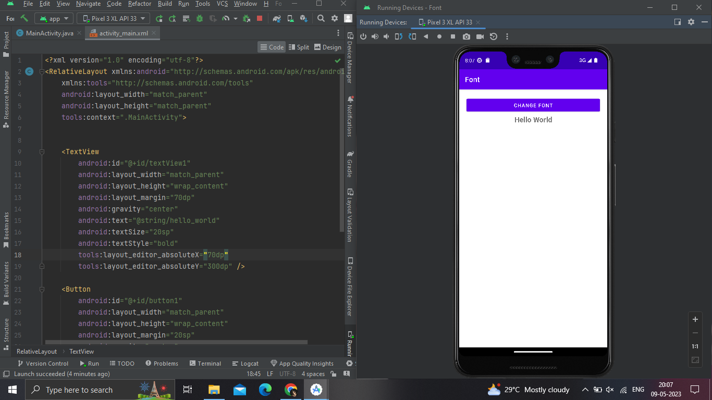

# Ex.No:2 Develop an application that uses Font Size using Android Studio.


## AIM:
To develop an application that uses Font Size using android studio.

## EQUIPMENTS REQUIRED:

Android Studio(Min. required Artic Fox)


## ALGORITHM:
Step 1: Create a New Android Project:
              • Click New in the toolbar.
              • In the window that appears, open the Android folder, select Android Application Project,
              and click next.
              • Provide the application name and the project name and then finally give the desired
              package name.
              • Choose a launcher icon for your application and then select Blank Activity and then click
              Next
              • Provide the desired Activity name for your project and then click Finish.

Step 2: Create a New AVD (Android Virtual Device):
        • click Android Virtual Device Manager from the toolbar.
        • In the Android Virtual Device Manager panel, click New.
        • Fill in the details for the AVD. Give it a name, a platform target, an SD card size, and
        a skin (HVGA is default).
        • Click Create AVD and Select the new AVD from the Android Virtual Device
        Manager and click Start.

Step 3: Design the graphical layout with a text view and two command buttons.

Step 4: Run the application.

Step 5:On pressing the change font size button, the size of the font gets altered.       
       
Step 6:Close the Android project. 


## Program:
 ```
Program to Develop an application that uses Font Size using Android Studio .
Developed by: Dharshini D.S
RegisterNumber: 212221230022
```
## MainActivity.java:
```
package com.example.font;

import android.os.Bundle;
import android.widget.Button;
import android.widget.TextView;

import androidx.appcompat.app.AppCompatActivity;

public class MainActivity extends AppCompatActivity {
    float font = 24;

    @Override
    protected void onCreate(Bundle savedInstanceState) {
        super.onCreate(savedInstanceState);
        setContentView(R.layout.activity_main);
        final TextView t1 = findViewById(R.id.textView1);
        Button b1 = findViewById(R.id.button1);
        b1.setOnClickListener(view -> {
            t1.setTextSize(font);
            font = font+4;
            if(font==40)
                font = 20;
        });

    }
}
```

## activity_main.xml:
```
<?xml version="1.0" encoding="utf-8"?>
<RelativeLayout xmlns:android="http://schemas.android.com/apk/res/android"
    xmlns:tools="http://schemas.android.com/tools"
    android:layout_width="match_parent"
    android:layout_height="match_parent"
    tools:context=".MainActivity">


    <TextView
        android:id="@+id/textView1"
        android:layout_width="match_parent"
        android:layout_height="wrap_content"
        android:layout_margin="70dp"
        android:gravity="center"
        android:text="@string/hello_world"
        android:textSize="20sp"
        android:textStyle="bold"
        tools:layout_editor_absoluteX="70dp"
        tools:layout_editor_absoluteY="300dp" />

    <Button
        android:id="@+id/button1"
        android:layout_width="match_parent"
        android:layout_height="wrap_content"
        android:layout_margin="20sp"
        android:gravity="center"
        android:text="@string/change_font_size"
        tools:layout_editor_absoluteX="40dp"
        tools:layout_editor_absoluteY="300dp"
        tools:ignore="VisualLintButtonSize"
        android:layout_marginTop="20sp"
        android:layout_marginStart="20sp"
        android:layout_marginEnd="20sp"
        android:layout_marginBottom="20sp" />


</RelativeLayout>
```
## Output:




## Result:
Thus, the program for android application, Font Size was executed successfully using Android Studio.
